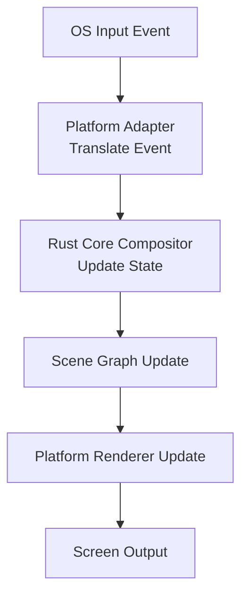
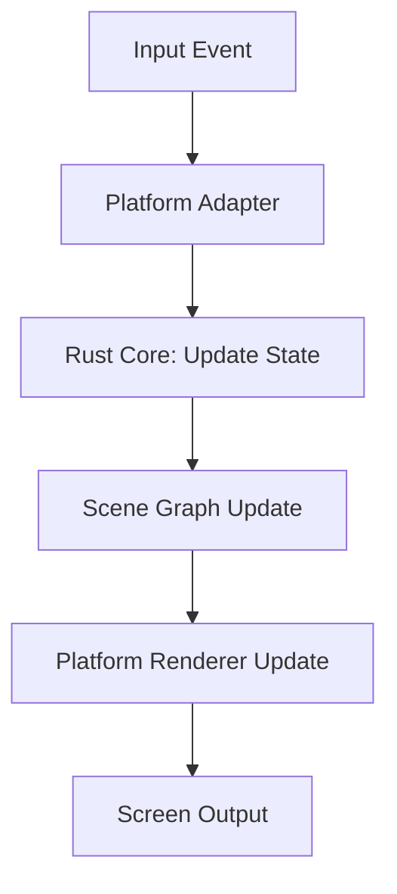
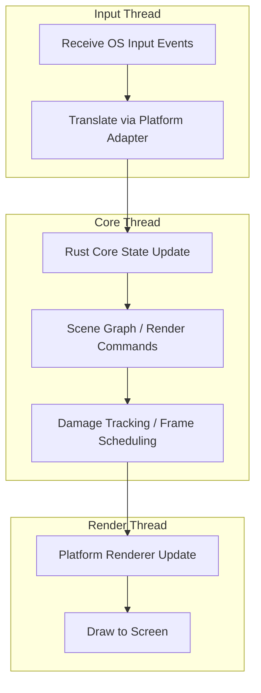

# **Wawona Compositor — Architecture & Project Structure (Mermaid Version)**

> **Rust backend + Native frontend architecture**
> All compositor logic (Wayland protocol, surfaces, windows, input, IPC, frame timing, etc.) lives in Rust.
> Platform frontends are written in **native languages** (Objective-C, Swift, Kotlin) and call Rust via FFI.
> Rendering uses native GPU APIs: Metal for macOS/iOS, Vulkan/Canvas for Android.

---


# **Wawona Compositor — Annotated Project Layout**

```
src/
├── lib.rs
│   └─ Top-level crate root; re-exports modules; contains no platform code
├── prelude.rs
│   └─ Common imports, traits, error helpers for core & platform code
├── version.rs
│   └─ Protocol and build versioning

├── core/                       # 🚀 Platform-agnostic compositor logic
│   ├── mod.rs                  # Re-exports submodules
│   ├── compositor.rs           # Central compositor object & lifecycle
│   ├── runtime.rs              # Event loop, task scheduling, frame loop
│   ├── state.rs                # Global compositor state graph
│   ├── errors.rs               # Core error types
│
│   ├── wayland/                # Wayland protocol & protocol handling
│   │   ├── mod.rs
│   │   ├── display.rs           # Display object & client registry
│   │   ├── registry.rs          # Global registry & binding
│   │   ├── compositor.rs        # wl_compositor, wl_shm implementation
│   │   ├── xdg_shell.rs         # xdg_wm_base, xdg_surface, xdg_toplevel
│   │   ├── seat.rs              # wl_seat, pointer, keyboard, touch
│   │   ├── output.rs            # wl_output implementation
│   │   ├── decoration.rs        # xdg_decoration implementation
│   │   ├── protocol/            # Unified protocol re-exports (client & server)
│   │   │   ├── mod.rs           # Unified client/server re-exports
│   │   │   ├── server/          # Server-side protocol bindings (67+ protocols)
│   │   │   │   ├── wayland_core # Core wayland (wl_compositor, wl_surface, etc.)
│   │   │   │   ├── wp           # Wayland platform protocols (viewporter, dmabuf, etc.)
│   │   │   │   ├── xdg          # XDG shell protocols (xdg_shell, decoration, etc.)
│   │   │   │   ├── ext          # Extended protocols (session_lock, idle_notify, etc.)
│   │   │   │   ├── xwayland     # XWayland protocols
│   │   │   │   └── wlroots      # wlroots protocols (layer_shell, screencopy, etc.)
│   │   │   ├── client/          # Client-side protocol bindings (for testing)
│   │   │   │   ├── wayland_core # Core wayland (client-side)
│   │   │   │   ├── wp           # Wayland platform protocols
│   │   │   │   ├── xdg          # XDG shell protocols
│   │   │   │   ├── ext          # Extended protocols
│   │   │   │   ├── xwayland     # XWayland protocols
│   │   │   │   └── wlroots      # wlroots protocols (client-side)
│   │   │   └── wlroots/         # wlroots protocol details submodule
│   │   │       └── mod.rs       # Re-exports from wayland-protocols-wlr crate
│   │   └── validation.rs       # Wayland protocol correctness checks
│
│   ├── surface/                # Surface and buffer lifecycle
│   │   ├── mod.rs
│   │   ├── surface.rs           # Surface object + state
│   │   ├── buffer.rs            # GPU-ready buffers (RGBA8, textures)
│   │   ├── role.rs              # Surface roles (top-level, popup, etc.)
│   │   ├── commit.rs            # Apply surface state changes atomically
│   │   └── damage.rs            # Track dirty regions for rendering
│
│   ├── window/                 # Window management & policy
│   │   ├── mod.rs
│   │   ├── window.rs            # Window object + state
│   │   ├── tree.rs              # Window tree / hierarchy
│   │   ├── focus.rs             # Focus policy & active window
│   │   ├── resize.rs            # Resize behavior & constraints
│   │   └── fullscreen.rs        # Fullscreen / maximize logic
│
│   ├── input/                  # OS-independent input abstraction
│   │   ├── mod.rs
│   │   ├── seat.rs              # Seat abstraction (keyboard, pointer, touch)
│   │   ├── keyboard.rs
│   │   ├── pointer.rs
│   │   ├── touch.rs
│   │   └── gestures.rs          # Multi-touch / gesture handling
│
│   ├── render/                 # Abstract rendering model / scene graph
│   │   ├── mod.rs
│   │   ├── scene.rs             # Scene graph root
│   │   ├── node.rs              # Nodes in scene graph
│   │   ├── transform.rs         # Position, rotation, scale
│   │   └── damage.rs            # Track dirty regions for efficient redraw
│
│   ├── ipc/                    # External control / debug
│   │   ├── mod.rs
│   │   └── commands.rs          # IPC command definitions
│
│   └── time/                   # Frame timing and scheduler
│       ├── mod.rs
│       └── frame_clock.rs       # Frame clock and scheduler for compositor

├── platform/                   # 🧩 Platform-specific native frontends
│   ├── mod.rs                  # Platform trait definitions (Rust)
│   ├── api.rs                  # Platform interface (Rust)
│   │
│   ├── macos/                  # macOS Native Frontend (Objective-C + Metal)
│   │   ├── main.m              # macOS entry point
│   │   ├── WawonaCompositor.m  # Main compositor lifecycle
│   │   ├── WawonaCompositorView_macos.m  # CAMetalLayer view
│   │   ├── WawonaWindowManager.m   # NSWindow management
│   │   ├── WawonaRenderManager.m   # Metal rendering
│   │   ├── metal_dmabuf.m      # DMA-BUF → Metal texture
│   │   ├── metal_waypipe.m     # Waypipe Metal integration
│   │   ├── WawonaEventLoopManager.m  # CVDisplayLink
│   │   ├── WawonaFrameCallbackManager.m  # Frame timing
│   │   ├── ... (23 .m files total)  # Full macOS frontend
│   │   └── (AppKit integration, Metal rendering, event loop)
│   │
│   ├── ios/                    # iOS Native Frontend (Objective-C/Swift + Metal)
│   │   ├── WawonaCompositorView_ios.m  # CAMetalLayer UIView
│   │   └── (⚠️ Work in progress - currently shares files with macOS)
│   │       (UIKit integration, Metal rendering, touch input)
│   │
│   └── android/                # Android Native Frontend (Kotlin)
│       ├── AndroidManifest.xml
│       ├── java/               # Kotlin/Java source
│       ├── res/                # Android resources
│       └── (Jetpack Compose, UniFFI bindings)

├── ffi/                        # 🔗 Stable FFI boundary
│   ├── mod.rs
│   ├── api.rs                   # UniFFI-exposed Rust API
│   ├── types.rs                 # FFI-safe structs/enums
│   ├── errors.rs                # FFI error mapping
│   ├── callbacks.rs             # Platform callback traits
│   └── uniffi.toml              # UniFFI interface definition

├── ui/                         # 🪟 Platform-independent UI models
│   ├── mod.rs
│   ├── state.rs                 # Observable UI state
│   ├── events.rs                # UI → compositor intents
│   └── bindings.rs              # UniFFI-friendly observers

├── config/                     # User/system configuration
│   ├── mod.rs
│   ├── defaults.rs
│   └── parse.rs                 # Config parser

├── util/                       # Shared utilities
│   ├── mod.rs
│   ├── geometry.rs
│   ├── arena.rs                 # Memory arena helpers
│   ├── id.rs                    # Unique identifiers
│   └── tracing.rs               # Logging / tracing utilities

└── tests/                      # Core logic tests (no platform deps)
    ├── mod.rs
    ├── wayland.rs
    ├── surface.rs
    └── window.rs
```

---

### ✅ Notes on This Layout

* **`core/`**: All shared compositor logic, OS-independent, fully testable. Includes Wayland protocols, surfaces, windows, input routing, scene graph, IPC, timing.
* **`platform/`**: Trait definitions only. **Actual frontends are native code** (Objective-C, Swift, Kotlin).
* **`ffi/`**: Stable FFI boundary using UniFFI. This is how native frontends call into Rust.
* **`ui/`**: Platform-independent UI state; drives declarative rendering.
* **`util/`**: Helpers shared across core modules.
* **`tests/`**: Unit tests for Rust core logic.

### 🔑 Native Frontend Architecture

Native frontends (macOS, iOS, Android) are written in their native languages, **not Rust**:

| Platform | Language | GUI Framework | Rendering | Location |
|----------|----------|---------------|-----------|----------|
| macOS | Objective-C | AppKit | Metal | `src/platform/macos/` (23 .m files) |
| iOS | Objective-C/Swift | UIKit | Metal | `src/platform/ios/` |
| Android | Kotlin | Jetpack Compose | Vulkan/Canvas | `src/platform/android/` |

**Why native frontends?**
- Full access to platform APIs (AppKit, UIKit, Compose)
- Better IDE support and debugging
- No limitations from Rust FFI wrappers (cacao, objc2)
- Platform specialists can maintain frontend code

--- 

## **2. Native Frontend → FFI → Rust Backend Flow**

```mermaid
flowchart TD
    OS[Native OS Events\n(NSEvent / UIEvent / MotionEvent)]
    Frontend[Native Frontend\n(Objective-C / Swift / Kotlin)]
    FFI[FFI Layer\n(src/ffi/*)\nUniFFI-generated bindings]
    Core[Rust Core Compositor\n(src/core/*)\nWayland, Surfaces, Windows,\nInput, Scene Graph, IPC]
    Scene[RenderScene\n(from get_render_scene)]
    Renderer[Native Renderer\n(Metal / Vulkan / Canvas)]
    Display[Display Output]

    OS --> Frontend
    Frontend -->|inject_pointer_motion\ninject_key\nprocess_events| FFI
    FFI --> Core
    Core -->|Wayland Protocol| Core
    Frontend -->|get_render_scene| FFI
    FFI --> Scene
    Scene --> Renderer
    Renderer --> Display
```

---

## **3. Event Flow**



---

## **4. Draw / Redraw Cycle**



---

## **5. Threading & Safety Notes (Mermaid Swimlane)**



---

## ✅ Key Design Principles (Mermaid Summary)

```mermaid
flowchart TD
    Core[Rust Core (sacred)]
    Platform[Platform Adapter (thin)]
    FFI[FFI Layer (stable)]
    UI[UI Observers / ViewModels]
    Output[Native Rendering / Screen]

    Core -->|State| UI
    UI -->|Observe / Draw| Platform
    Core -->|Expose APIs| FFI
    FFI -->|Calls| Core
    Core -->|Scene Graph| Platform
    Platform --> Output
```

* **Core**: All shared logic; OS-agnostic; testable
* **Platform**: Thin adapter; translates events, renders buffers
* **FFI**: UniFFI boundary; safe memory & threading
* **UI**: Rust-driven, declarative
* **Output**: Native GPU/Canvas rendering

---

## **6. Wayland Protocol Support**

Wawona supports standard Wayland protocols via **crate re-exports** from the Rust ecosystem.

### Protocol Architecture

All protocols are accessible from a **single unified location**: `src/core/wayland/protocol/`

This module provides both server-side (compositor implementation) and client-side (testing/nested compositor) protocol bindings through organized submodules.

**Key Design Principles:**
- **Single source of truth**: All protocols in `src/core/wayland/protocol/`
- **Crate re-exports**: No custom code generation, use established Rust crates
- **Client/Server separation**: Clear organization for different use cases
- **67+ protocols**: Full ecosystem compatibility

| Crate | Version | Contents |
|-------|---------|----------|
| `wayland-server` / `wayland-client` | 0.31+ | Core wayland protocol (wl_compositor, wl_surface, etc.) |
| `wayland-protocols` | 0.32+ | Official extensions (wp, xdg, ext, xwayland) |
| `wayland-protocols-wlr` | 0.3+ | wlroots extensions (layer_shell, screencopy, etc.) |
| `wayland-protocols-misc` | 0.3+ | Misc protocols (virtual_keyboard, gtk_primary_selection) |

### Protocol Module Structure

```
src/core/wayland/protocol/
├── mod.rs                    # Main protocol module
├── server/                   # Server-side bindings (compositor implementation)
│   ├── wayland_core          # Core protocol (wl_compositor, wl_surface, etc.)
│   ├── wp                    # Platform protocols (viewporter, dmabuf, fractional_scale, etc.)
│   ├── xdg                   # XDG shell (xdg_shell, xdg_decoration, xdg_activation, etc.)
│   ├── ext                   # Extended protocols (session_lock, idle_notify, foreign_toplevel, etc.)
│   ├── xwayland              # XWayland protocols
│   └── wlroots               # wlroots protocols (layer_shell, screencopy, gamma_control, etc.)
├── client/                   # Client-side bindings (testing/nested compositor)
│   ├── wayland_core          # Core protocol (client-side)
│   ├── wp                    # Platform protocols
│   ├── xdg                   # XDG shell
│   ├── ext                   # Extended protocols
│   ├── xwayland              # XWayland protocols
│   └── wlroots               # wlroots protocols (client-side)
└── wlroots/                  # wlroots protocol details submodule
    └── mod.rs                # Re-exports from wayland-protocols-wlr crate
```

### Usage Examples

```rust
// Server-side: implementing xdg-shell
use crate::core::wayland::protocol::server::xdg::shell;

// Server-side: implementing wlr-layer-shell
use crate::core::wayland::protocol::server::wlroots;

// Client-side (for testing)
use crate::core::wayland::protocol::client::xdg::shell;
```

### Protocol Implementation Status

| Category | Protocol | Status |
|----------|----------|--------|
| **Core** | wl_compositor, wl_shm | ✅ Complete |
| **Core** | wl_seat (pointer, keyboard, touch) | ✅ Complete |
| **Core** | wl_output | ✅ Complete |
| **Core** | wl_subcompositor | ✅ Complete |
| **Core** | wl_data_device_manager | ✅ Complete |
| **XDG** | xdg_shell (wm_base, surface, toplevel, popup) | ✅ Complete |
| **XDG** | xdg_decoration | ✅ Complete |
| **XDG** | xdg_output | ✅ Complete |
| **Buffer** | linux_dmabuf_v1 | ✅ Complete |
| **Buffer** | linux_explicit_synchronization | ✅ Complete |
| **Timing** | presentation_time | ✅ Complete |
| **Input** | pointer_constraints | ✅ Complete |
| **Input** | pointer_gestures | ✅ Complete |
| **Input** | relative_pointer | ✅ Complete |
| **Input** | text_input_v3 | ✅ Complete |
| **Input** | keyboard_shortcuts_inhibit | ✅ Complete |
| **Window** | viewporter | ✅ Complete |
| **Session** | idle_inhibit | ✅ Complete |
| **Tablet** | tablet_v2 | ✅ Complete |
| **Cursor** | cursor_shape_v1, primary_selection | ✅ Complete |
| **Timing** | fractional_scale, fifo_v1, tearing_control_v1, commit_timing_v1, content_type | ✅ Complete |
| **Window Ext** | xdg_activation, xdg_dialog, xdg_toplevel_drag, xdg_toplevel_icon | ✅ Complete |
| **Session Ext** | ext_session_lock, ext_idle_notify | ✅ Complete |
| **Advanced** | single_pixel_buffer, alpha_modifier | ✅ Complete |

### Registered Wayland Globals (67 protocols)

All protocols are registered in `src/core/compositor.rs::register_globals()`:

**Core Protocols (6):**
- `wl_compositor` v6 - Surface creation and management
- `wl_shm` v1 - Shared memory buffers
- `wl_subcompositor` v1 - Subsurface support
- `wl_data_device_manager` v3 - Clipboard and drag-and-drop
- `wl_output` v4 - Display output information
- `wl_seat` v8 - Input devices (pointer, keyboard, touch)

**XDG Shell & Extensions (10):**
- `xdg_wm_base` v5 - Window management
- `zxdg_decoration_manager_v1` v1 - Window decorations (CSD/SSD)
- `zxdg_output_manager_v1` v3 - Extended output info
- `zxdg_exporter_v2` v2 - Export toplevels for embedding
- `zxdg_importer_v2` v2 - Import toplevels for embedding
- `xdg_activation_v1` v1 - Focus stealing prevention
- `xdg_wm_dialog_v1` v1 - Dialog window hints
- `xdg_toplevel_drag_manager_v1` v1 - Drag entire windows
- `xdg_toplevel_icon_manager_v1` v1 - Window icons
- `xdg_toplevel_tag_manager_v1` v1 - Session restore tagging
- `xdg_system_bell_v1` v1 - Notification sounds

**Buffer & Synchronization (5):**
- `zwp_linux_dmabuf_v1` v4 - DMA-BUF GPU buffer sharing
- `zwp_linux_explicit_synchronization_v1` v1 - Explicit buffer sync
- `wp_single_pixel_buffer_manager_v1` v1 - Solid color surfaces
- `wp_linux_drm_syncobj_manager_v1` v1 - DRM explicit sync
- `wp_drm_lease_device_v1` v1 - VR/AR display leasing

**Input & Interaction (11):**
- `zwp_relative_pointer_manager_v1` v1 - Relative pointer motion
- `zwp_pointer_constraints_v1` v1 - Pointer lock/confine
- `zwp_pointer_gestures_v1` v1 - Swipe/pinch gestures
- `zwp_tablet_manager_v2` v1 - Graphics tablet support
- `zwp_text_input_manager_v3` v1 - IME text input
- `zwp_keyboard_shortcuts_inhibit_manager_v1` v1 - Disable compositor shortcuts
- `wp_cursor_shape_manager_v1` v1 - Predefined cursor shapes
- `zwp_primary_selection_device_manager_v1` v1 - Middle-click paste
- `zwp_input_panel_v1` v1 - Input panel for IME
- `zwp_input_timestamps_manager_v1` v1 - High-resolution input timing
- `wp_pointer_warp_v1` v1 - Pointer teleportation

**Presentation & Timing (9):**
- `wp_presentation` v1 - Frame timing feedback
- `wp_viewporter` v1 - Surface cropping/scaling
- `wp_fractional_scale_manager_v1` v1 - HiDPI scaling
- `wp_fifo_manager_v1` v1 - Presentation ordering
- `wp_tearing_control_manager_v1` v1 - Vsync hints
- `wp_commit_timing_manager_v1` v1 - Frame timing hints
- `wp_content_type_manager_v1` v1 - Content type hints
- `wp_color_manager_v1` v1 - HDR and color space support
- `wp_color_representation_manager_v1` v1 - Color format hints

**Session & Security (5):**
- `zwp_idle_inhibit_manager_v1` v1 - Prevent system idle
- `ext_session_lock_manager_v1` v1 - Screen locking
- `ext_idle_notifier_v1` v1 - User idle notifications
- `wp_security_context_manager_v1` v1 - Sandboxed connections
- `ext_transient_seat_manager_v1` v1 - Remote desktop seats

**Desktop Integration (6):**
- `wp_alpha_modifier_v1` v1 - Alpha blending
- `zwp_fullscreen_shell_v1` v1 - Kiosk mode shell
- `ext_foreign_toplevel_list_v1` v1 - Task bar support
- `ext_data_control_manager_v1` v1 - Clipboard managers
- `ext_workspace_manager_v1` v1 - Virtual desktop management
- `ext_background_effect_manager_v1` v1 - Blur effects

**Screen Capture & XWayland (4):**
- `ext_output_image_capture_source_manager_v1` v1 - Capture sources
- `ext_image_copy_capture_manager_v1` v1 - Screen capture
- `zwp_xwayland_keyboard_grab_manager_v1` v1 - XWayland input
- `xwayland_shell_v1` v1 - XWayland surface integration

**wlroots (10):**
- `zwlr_layer_shell_v1` - Panels, overlays (CRITICAL)
- `zwlr_output_management_v1` - Display configuration
- `zwlr_foreign_toplevel_management_v1` - Task bars
- `zwlr_screencopy_manager_v1` - Screen capture
- `zwlr_gamma_control_manager_v1` - Night light
- `zwlr_data_control_manager_v1` - Clipboard managers
- `zwlr_export_dmabuf_manager_v1` - GPU buffer export
- `zwlr_virtual_pointer_manager_v1` - Virtual pointers
- `zwp_virtual_keyboard_v1` - Virtual keyboards
- `zwlr_input_inhibitor_v1` - Input inhibitor

**Total: 67 wayland-protocols registered and functional**

Using **wayland-protocols 0.32.10**, **wlr 0.3.10**, **misc 0.3.10**.

---

### wlroots Protocol Support

For ecosystem compatibility with Sway, Hyprland, and other wlroots-based tools, we use the `wayland-protocols-wlr` crate.

All 10 wlroots protocols are re-exported in `src/core/wayland/protocol/wlroots/` and have their globals registered.

**Current Status:**
- All 67 protocols fully available via crate re-exports.
- No local file generation required.
- Dispatch traits implemented in `src/core/wayland/`.


---

## **7. macOS GPU Acceleration (DMABUF via IOSurface)**

To support hardware-accelerated clients (like `weston-terminal`, browsers, MPV) on macOS, Wawona implements a custom zero-copy path for Wayland `linux-dmabuf` buffers.

### Problem
macOS does not support Linux DMA-BUFs natively. `waypipe` or standard Wayland clients expect `dmabuf` file descriptors for GPU buffer sharing.

### Solution: IOSurface Tunneling
Wawona intercepts DMABUF requests and maps them to macOS `IOSurface` handles.

```mermaid
flowchart LR
    Client[Wayland Client\n(Weston/GL)] -->|Allocates\nIOSurface| Allocator[Mesa/Waypipe]
    Allocator -->|zwp_linux_dmabuf_v1\ncreate_immed| Core[Rust Core]
    
    subgraph Wawona ["Wawona Compositor"]
        Core -->|Extract ID| Buffer[Buffer::Native(ID)]
        Buffer .->|FFI\nBufferData::Iosurface| Bridge[ObjC Bridge]
        Bridge -->|IOSurfaceLookup(ID)| Layer[CAMetalLayer\n.contents = surface]
    end
    
    Allocator -.->|ID in Modifier| Core
```

1. **Allocation**: `waypipe` (patched) or a custom allocator allocates an `IOSurface` and sends its global ID in the **modifier** field of the `zwp_linux_dmabuf_v1` request.
2. **Intercept**: Wawona Core detects the custom modifier (`0x80...`), extracts the ID, and creates a `BufferType::Native`.
3. **Scanout**: When attached to a surface, the ID is passed to the macOS frontend via FFI.
4. **Zero-Copy**: The Objective-C bridge performs an `IOSurfaceLookup` and assigns the surface directly to the `CAMetalLayer`'s contents.

This allows full GPU performance without expensive CPU copies.

---

## **8. Declarative Build System (Nix)**

Wawona uses **Nix** as the single source of truth for the build environment, dependencies, and toolchain versions across all platforms (macOS, iOS, Android).

> **Goal**: A fully declarative repo where `nix` defines:
> * **Environment Variables**: Injected via `devShells` and wrappers.
> * **Toolchains**: Rust, Clang, Android SDK, Xcode environment (via paths).
> * **Applications**: Run targets like `wawona-macos`, `wawona-ios`, `wawona-android`.
> * **Project Generation**: `xcodegen` (iOS/macOS) and `gradlegen` (Android) config via Nix.

### Platform Build Strategies
- **macOS**: Pure Nix build (`nix build`). Dependencies linked via Nix store.
- **iOS**: Hybrid Nix + XcodeGen. Nix provides dependencies & tools; XcodeGen generates `.xcodeproj` for signing/simulator.
- **Android**: Hybrid Nix + GradleGen. Nix provides Android SDK/NDK; GradleGen generates build files.

### iOS Workflow (`nix run .#wawona-ios`)
 
 Running `nix run .#wawona-ios` fully automates the development cycle:
 
 1. **Environment Setup**: Checks for `TEAM_ID` (required for signing).
 2. **Project Generation**: Runs `xcodegen` to generate `Wawona.xcodeproj`.
 3. **Simulator Management**: 
    - Checks for a simulator named "Wawona iOS".
    - Creates it (iPhone 14) if missing.
    - Boots the simulator.
 4. **Build & Run**:
    - Builds the app using `xcodebuild` for the simulator.
    - Installs and launches the app automatically.
    - Does **NOT** open Xcode GUI (uses headless build).
 
 ### Xcode Project Generation (`nix run .#xcodegen`)
 
 If you want to edit code in Xcode:
 1. Run `nix run .#xcodegen`.
 2. This generates the project and **opens Xcode** for you.
 3. You can then build/run manually from the IDE.

### Key Nix Modules
*   **`flake.nix`**: Defines the `wawona-ios`, `wawona-macos`, `wawona-android` packages and apps.
*   **`dependencies/wawona-ios.nix`**: The Nix derivation for iOS dependencies and build environment.
*   **`dependencies/wawona-macos.nix`**: The Nix derivation for the macOS native frontend + Rust backend build.
*   **`dependencies/wawona-android.nix`**: The Nix derivation for the Android build (APK + native libs).
*   **`dependencies/wawona-common.nix`**: Shared sources, dependencies, and flags used by all platform modules.
*   **`dependencies/xcodegen-wawona.nix`**: The XcodeGen configuration, translated to Nix. It defines the project structure, targets, and file references.

### Environment Variables
The Nix devshell injects necessary environment variables for the build:
*   `SDKROOT`: Path to the iOS SDK.
*   `DEVELOPER_DIR`: Path to Xcode Developer directory.
*   `wawonaVersion`: Project version.
