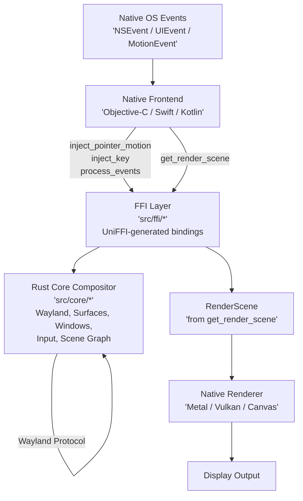
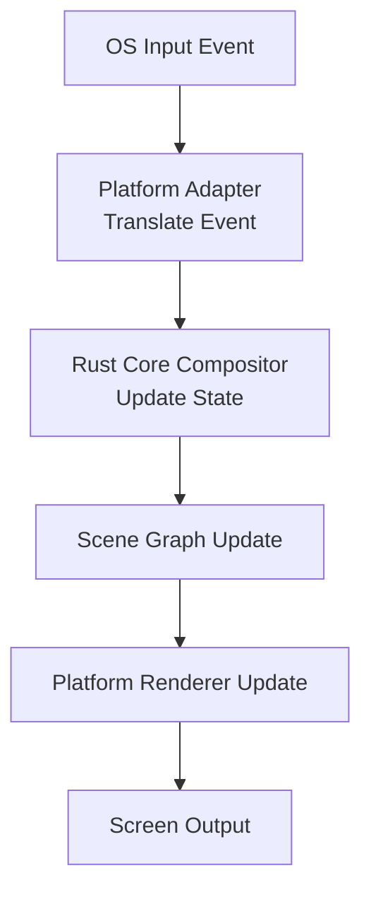
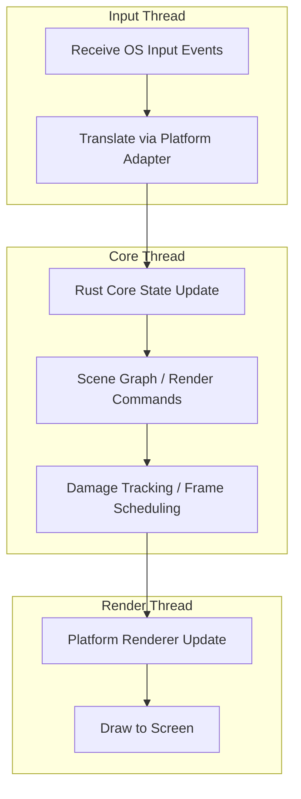
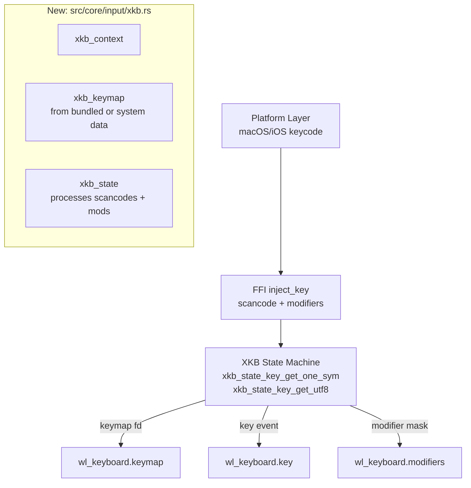
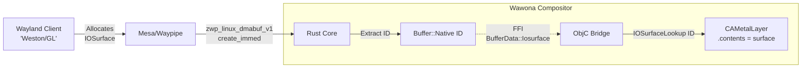

# **Wawona Compositor — Architecture & Project Structure**

> **Rust backend + Native frontend architecture**
> All compositor logic (Wayland protocol, surfaces, windows, input, IPC, frame timing, etc.) lives in Rust.
> Platform frontends are written in **native languages** (Objective-C, Swift, Kotlin) and call Rust via FFI.
> Rendering uses native GPU APIs: Metal for macOS/iOS, Vulkan/Canvas for Android.

---

## **1. Annotated Project Layout**

### Current Layout (as-built)

```
src/
├── lib.rs                      # Crate root; re-exports modules; UniFFI scaffolding
├── main.rs                     # CLI entry point (StubPlatform)
│
├── core/                       # 🚀 Platform-agnostic compositor logic
│   ├── mod.rs                  # Re-exports: Compositor, Runtime, CompositorState
│   ├── compositor.rs           # Compositor lifecycle, Wayland display, client connections (624 lines)
│   ├── runtime.rs              # Event loop, frame timing, task scheduling (424 lines)
│   ├── state.rs                # ⚠️ MONOLITH: All compositor state (2312 lines, 50+ HashMaps)
│   ├── input.rs                # Minimal input event types (43 lines)
│   │
│   ├── surface/                # Surface & buffer lifecycle
│   │   ├── mod.rs
│   │   ├── surface.rs          # Surface object + pending/committed state
│   │   ├── buffer.rs           # Buffer types (SHM, Native/IOSurface, DmaBuf)
│   │   ├── commit.rs           # Double-buffered commit logic
│   │   └── damage.rs           # Damage region tracking
│   │
│   ├── window/                 # Window management
│   │   ├── mod.rs
│   │   ├── window.rs           # Window object + decoration mode
│   │   ├── tree.rs             # Z-order window tree
│   │   └── focus.rs            # Focus manager with history
│   │
│   └── wayland/                # Wayland protocol implementations
│       ├── mod.rs              # Root: re-exports wayland, xdg, wlr, plasma, ext
│       ├── protocol/           # Centralized protocol crate re-exports
│       │   ├── mod.rs          # Unified client/server re-exports
│       │   ├── server/         # Server-side bindings (67+ protocols)
│       │   └── client/         # Client-side bindings (for testing)
│       │
│       ├── wayland/            # Core protocols (6 globals)
│       │   ├── mod.rs          # register_wayland_globals()
│       │   ├── compositor.rs   # wl_compositor — surface creation
│       │   ├── shm.rs          # wl_shm — shared memory buffer pools
│       │   ├── seat.rs         # wl_seat — keyboard/pointer/touch + XKB keymap
│       │   ├── output.rs       # wl_output — display info
│       │   ├── subcompositor.rs # wl_subcompositor — subsurface management
│       │   ├── data_device.rs  # wl_data_device — clipboard/DnD
│       │   └── registry.rs     # (stub)
│       │
│       ├── xdg/                # XDG Shell protocols (9 globals)
│       │   ├── mod.rs          # register_xdg_globals()
│       │   ├── xdg_shell.rs    # xdg_wm_base, xdg_surface, xdg_toplevel, xdg_popup
│       │   ├── decoration.rs   # zxdg_decoration — CSD/SSD negotiation
│       │   ├── xdg_output.rs   # zxdg_output — extended output info
│       │   ├── activation.rs   # xdg_activation — focus stealing prevention
│       │   ├── dialog.rs       # xdg_wm_dialog — dialog hints
│       │   ├── toplevel_drag.rs # xdg_toplevel_drag — window dragging
│       │   ├── toplevel_icon.rs # xdg_toplevel_icon — window icons
│       │   ├── exporter.rs     # zxdg_exporter/importer — cross-client embedding
│       │   └── ...
│       │
│       ├── wlr/                # wlroots protocols (10 globals)
│       │   ├── mod.rs          # register_wlr_globals()
│       │   ├── layer_shell.rs  # zwlr_layer_shell — panels, overlays
│       │   ├── output_management.rs # zwlr_output_manager — display config
│       │   ├── screencopy.rs   # zwlr_screencopy — screen capture
│       │   ├── foreign_toplevel.rs # zwlr_foreign_toplevel — taskbars
│       │   ├── data_control.rs # zwlr_data_control — clipboard managers
│       │   ├── gamma_control.rs # zwlr_gamma_control — night light
│       │   ├── virtual_pointer.rs # zwlr_virtual_pointer
│       │   ├── virtual_keyboard.rs # zwp_virtual_keyboard
│       │   └── ...
│       │
│       ├── ext/                 # Extension protocols (42+ files)
│       │   ├── mod.rs           # register_ext_globals()
│       │   ├── linux_dmabuf.rs  # zwp_linux_dmabuf — GPU buffer sharing
│       │   ├── text_input.rs    # zwp_text_input — IME
│       │   ├── pointer_constraints.rs
│       │   ├── presentation_time.rs
│       │   ├── fractional_scale.rs
│       │   ├── viewporter.rs
│       │   ├── cursor_shape.rs
│       │   ├── idle_inhibit.rs
│       │   ├── session_lock.rs
│       │   └── ... (30+ more protocol files)
│       │
│       └── plasma/              # KDE/Plasma protocols (7 globals)
│           ├── mod.rs           # register_plasma_globals()
│           └── ...
│
├── ffi/                         # 🔗 Stable FFI boundary (UniFFI)
│   ├── mod.rs
│   ├── api.rs                   # WawonaCore — main FFI object (1816 lines)
│   ├── types.rs                 # FFI-safe structs/enums (24KB)
│   ├── errors.rs                # FFI error mapping
│   ├── callbacks.rs             # Platform callback traits
│   └── c_api.rs                 # C-compatible API wrappers
│
├── platform/                    # 🧩 Platform trait definitions (Rust side)
│   ├── mod.rs
│   └── api.rs                   # Platform trait + StubPlatform
│
├── compat/                      # Native platform code
│   ├── macos/stubs/             # 67 Objective-C stub files (AppKit/Metal)
│   ├── ios/                     # iOS headers, sys bindings
│   └── android/                 # JNI bridge + Kotlin frontend (see §11)
│
├── config/                      # Configuration
│   └── mod.rs
│
├── util/                        # Shared utilities
│   ├── mod.rs
│   └── logging.rs               # wlog! macro, log categories
│
└── tests/                       # ⚠️ ALL STUBS — no actual tests
    ├── mod.rs                   # Declares wayland, surface, window modules
    ├── wayland.rs               # "// Stub for wayland tests"
    ├── surface.rs               # "// Stub for surface tests"
    └── window.rs                # "// Stub for window tests"
```

### Target Layout (planned revision)

The revision follows Smithay's proven modular pattern, where each protocol subsystem owns its own state and handler logic, rather than dumping everything into a single monolithic `state.rs`.

```
src/core/
├── state.rs                     # DECOMPOSED: Core state + domain-specific sub-states
│   └── Contains: surfaces, windows, focus, seat, outputs, serial counter
│       All protocol-specific state MOVED to respective protocol modules
│
├── input/                       # EXPANDED from 43-line stub
│   ├── mod.rs                   # Re-exports
│   ├── seat.rs                  # Full seat abstraction (capabilities, resources)
│   ├── keyboard.rs              # XKB context/keymap/state machine, key repeat
│   ├── pointer.rs               # Pointer state, focus tracking, cursor management
│   ├── touch.rs                 # Multi-touch state, touch point tracking
│   └── xkb.rs                   # xkbcommon integration, keymap generation/bundling
│
├── wayland/
│   ├── ext/
│   │   ├── <protocol>.rs        # Each file: handler + OWN state struct (not in state.rs)
│   │   └── ...
│   └── ...
│
└── render/                      # NEW: Scene graph for platform rendering
    ├── scene.rs
    ├── node.rs
    └── damage.rs
```

> [!IMPORTANT]
> **Key structural change**: Protocol-specific state (e.g., `locked_pointers`, `activation_tokens`, `viewports`) currently stored as 50+ HashMaps in `state.rs` will migrate into their respective protocol modules. Each protocol handler owns and manages its own state.

---

## **2. Native Frontend → FFI → Rust Backend Flow**



---

## **3. Event Flow**



---

## **4. Threading & Safety**



---

## **5. Key Design Principles**

* **Core**: All shared logic; OS-agnostic; fully testable in isolation
* **Platform**: Thin adapter; translates native events, renders buffers via Metal/Vulkan
* **FFI**: UniFFI boundary; safe memory & threading; no Wayland types leak across
* **Protocol modules**: Each protocol owns its state + handler logic (Smithay pattern)
* **Output**: Native GPU/Canvas rendering consuming `RenderScene` from Rust

---

## **6. Wayland Protocol Support**

### Protocol Architecture

All protocols are accessible from a single unified location: `src/core/wayland/protocol/`

This module provides both server-side (compositor implementation) and client-side (testing/nested compositor) protocol bindings through organized submodules.

| Crate | Version | Contents |
|-------|---------|----------|
| `wayland-server` / `wayland-client` | 0.31+ | Core wayland protocol (wl_compositor, wl_surface, etc.) |
| `wayland-protocols` | 0.32+ | Official extensions (wp, xdg, ext, xwayland) |
| `wayland-protocols-wlr` | 0.3+ | wlroots extensions (layer_shell, screencopy, etc.) |
| `wayland-protocols-misc` | 0.3+ | Misc protocols (virtual_keyboard, gtk_primary_selection) |

### Protocol Implementation Status — Honest Assessment

> [!CAUTION]
> Previous documentation marked all 67 protocols as "✅ Complete." A thorough code audit reveals that most protocols are **registered** (global created, `Dispatch` trait implemented) but contain **stub-only request handlers** — they log incoming requests via `tracing::debug!()` but do **not** implement protocol semantics (state mutations, response events, error handling).

| Status | Meaning | Count |
|--------|---------|-------|
| 🟢 **Functional** | Handles requests, mutates state, sends proper events | ~10 |
| 🟡 **Partial** | Global registered, some requests handled, incomplete semantics | ~8 |
| 🔴 **Stub** | Global registered, all request handlers are `debug!()` only | ~49 |

#### Category Breakdown

| Category | Protocol | Implementation | Notes |
|----------|----------|---------------|-------|
| **Core** | `wl_compositor` | 🟢 Functional | Surface creation, commit, frame callbacks |
| **Core** | `wl_shm` | 🟢 Functional | Pool creation, buffer creation, mmap |
| **Core** | `wl_seat` | 🟡 Partial | Keyboard/pointer/touch resource binding works; **XKB uses hardcoded minimal keymap fallback** — no proper `xkbcommon` state machine |
| **Core** | `wl_output` | 🟢 Functional | Mode, geometry, scale, done events |
| **Core** | `wl_subcompositor` | 🟡 Partial | Subsurface creation tracked; z-order and sync/desync partially implemented |
| **Core** | `wl_data_device_manager` | 🟡 Partial | Data source/device creation; selection and DnD logic incomplete |
| **XDG** | `xdg_wm_base` | 🟢 Functional | Surface/toplevel/popup lifecycle, configure/ack, ping/pong |
| **XDG** | `xdg_decoration` | 🟢 Functional | CSD/SSD negotiation, mode switching; WindowCreated carries decoration_mode/fullscreen_shell; DecorationModeChanged C event; fullscreen shell → no host chrome |
| **XDG** | `xdg_output` | 🟡 Partial | Logical position/size sent; updates on output change incomplete |
| **XDG** | All others (activation, dialog, drag, icon, exporter/importer) | 🔴 Stub | Globals registered, requests logged only |
| **wlr** | `layer_shell` | 🟡 Partial | Layer surface creation tracked; anchor/margin/exclusive zone stored |
| **wlr** | All others (output_mgmt, screencopy, foreign_toplevel, etc.) | 🔴 Stub | Globals registered, requests logged only |
| **Buffer** | `linux_dmabuf_v1` | 🟡 Partial | Params creation tracked; IOSurface path for macOS exists; feedback objects stubbed |
| **Buffer** | All others (explicit_sync, drm_syncobj, drm_lease, single_pixel) | 🔴 Stub | Globals registered, requests logged only |
| **Input** | All (pointer_constraints, gestures, relative_pointer, text_input, etc.) | 🔴 Stub | Globals registered, requests logged only |
| **Timing** | `presentation_time` | 🟡 Partial | Feedback collection exists; presentation events incomplete |
| **Timing** | All others (fractional_scale, fifo, tearing, commit_timing, etc.) | 🔴 Stub | |
| **Session** | All (idle_inhibit, session_lock, idle_notify, security_context, etc.) | 🔴 Stub | |
| **Desktop** | All (alpha_modifier, foreign_toplevel_list, workspace, etc.) | 🔴 Stub | |
| **Capture** | All (image_capture_source, image_copy_capture, xwayland_*, etc.) | 🔴 Stub | |
| **Plasma** | All (kde_decoration, blur, contrast, shadow, dpms, etc.) | 🔴 Stub | |

### 68 Registered Globals (unchanged)

All 68 protocol globals are registered correctly at compositor startup. The issue is not registration — it's that **request handlers need semantic implementation**.

**Core (6):** wl_compositor v6, wl_shm v1, wl_subcompositor v1, wl_data_device_manager v3, wl_output v3, wl_seat v8

**XDG (9):** xdg_wm_base v5, zxdg_decoration_manager_v1, zxdg_output_manager_v1, zxdg_exporter_v2, zxdg_importer_v2, xdg_activation_v1, xdg_wm_dialog_v1, xdg_toplevel_drag_manager_v1, xdg_toplevel_icon_manager_v1

**KDE/Plasma (7):** org_kde_kwin_server_decoration_manager, blur_manager, contrast_manager, shadow_manager, dpms_manager, idle_timeout, slide_manager

**Buffer & Sync (5):** zwp_linux_dmabuf_v1 v4, zwp_linux_explicit_synchronization_v1, wp_single_pixel_buffer_manager_v1, wp_linux_drm_syncobj_manager_v1, wp_drm_lease_device_v1

**Input & Interaction (10):** zwp_relative_pointer_manager_v1, zwp_pointer_constraints_v1, zwp_pointer_gestures_v1, zwp_tablet_manager_v2, zwp_text_input_manager_v3, zwp_keyboard_shortcuts_inhibit_manager_v1, wp_cursor_shape_manager_v1, zwp_primary_selection_device_manager_v1, zwp_input_timestamps_manager_v1, wp_pointer_warp_v1

**Presentation & Timing (8):** wp_presentation, wp_viewporter, wp_fractional_scale_manager_v1, wp_fifo_manager_v1, wp_tearing_control_manager_v1, wp_commit_timing_manager_v1, wp_content_type_manager_v1, wp_color_representation_manager_v1

**Session & Security (5):** zwp_idle_inhibit_manager_v1, ext_session_lock_manager_v1, ext_idle_notifier_v1, wp_security_context_manager_v1, ext_transient_seat_manager_v1

**Desktop Integration (4):** wp_alpha_modifier_v1, ext_foreign_toplevel_list_v1, ext_workspace_manager_v1, ext_background_effect_manager_v1

**Screen Capture & XWayland (4):** ext_output_image_capture_source_manager_v1, ext_image_copy_capture_manager_v1, zwp_xwayland_keyboard_grab_manager_v1, xwayland_shell_v1

**wlroots (10):** zwlr_layer_shell_v1, zwlr_output_management_v1, zwlr_output_power_management_v1, zwlr_foreign_toplevel_management_v1, zwlr_screencopy_manager_v1, zwlr_gamma_control_manager_v1, zwlr_data_control_manager_v1, zwlr_export_dmabuf_manager_v1, zwlr_virtual_pointer_manager_v1, zwp_virtual_keyboard_v1

---

## **7. xkbcommon Integration Plan**

### Current State

The `seat.rs` `send_keymap()` function:
1. Calls `generate_xkb_keymap()` which tries to create an `xkb_context` + `xkb_keymap` via `xkbcommon` crate
2. If that fails (e.g., on iOS — missing XKB data files), falls back to `minimal_xkb_keymap()` — a hardcoded US QWERTY layout
3. Creates an fd (via `memfd_create` on Linux, temp file on macOS/iOS) and sends it to the client

**What's missing:**
- No `xkb_state` machine — modifier tracking is done manually via raw u32 bitmasks
- No scancode → keysym → UTF-8 pipeline on the compositor side
- No keymap update on layout change
- No key repeat management driven by XKB

### Target Architecture



**Key steps:**
1. Create `src/core/input/xkb.rs` with proper `xkb_context` → `xkb_keymap` → `xkb_state` lifecycle
2. Bundle XKB keymap data for platforms without system-installed XKB data (iOS, Android)
3. Use `xkb_state_update_mask()` for modifier events
4. Use `xkb_state_key_get_one_sym()` / `xkb_state_key_get_utf8()` for key processing

---

## **8. macOS GPU Acceleration (DMABUF via IOSurface)**

To support hardware-accelerated clients on macOS, Wawona implements a custom zero-copy path.



1. **Allocation**: `waypipe` (patched) or custom allocator allocates an `IOSurface`, sends its global ID in the modifier field
2. **Intercept**: Wawona Core detects the custom modifier, extracts the ID, creates `BufferType::Native`
3. **Scanout**: ID passed to macOS frontend via FFI
4. **Zero-Copy**: Objective-C bridge performs `IOSurfaceLookup` and assigns directly to `CAMetalLayer`

---

## **9. Declarative Build System (Nix)**

Wawona uses **Nix** as the single source of truth for all builds.

| Platform | Strategy | Command |
|----------|----------|---------|
| macOS | Pure Nix build | `nix build .#wawona-macos` |
| iOS | Hybrid Nix + XcodeGen | `nix run .#wawona-ios` |
| Android | Hybrid Nix + GradleGen | `nix run .#wawona-android` |
| Linux | DRM/KMS fullscreen | `nix build .#wawona-linux` |

### Key Nix Modules
- `flake.nix` — Defines all packages and apps
- `dependencies/wawona/ios.nix` — iOS build (XcodeGen + Xcode)
- `dependencies/wawona/macos.nix` — macOS native frontend + Rust backend
- `dependencies/wawona/android.nix` — Android build (APK + native libs + Rust backend)
- `dependencies/wawona/common.nix` — Shared sources, dependencies, flags
- `dependencies/wawona/rust-backend-ios.nix` — Rust core cross-compilation for iOS
- `dependencies/wawona/rust-backend-macos.nix` — Rust core for macOS
- `dependencies/wawona/rust-backend-android.nix` — Rust core + waypipe for Android (aarch64-linux-android)
- `dependencies/generators/xcodegen.nix` — XcodeGen project generation
- `dependencies/generators/gradlegen.nix` — Gradle build file generation

---

## **10. Waypipe Integration**

Waypipe enables remote Wayland application display over SSH.

| Platform | Transport | Buffer Path | Status |
|----------|-----------|-------------|--------|
| macOS | openssh process spawn | IOSurface → Metal | Working |
| iOS | libssh2 in-process | IOSurface → Metal | Built, needs integration |
| Android | **Dropbear SSH** (fork/exec) | SHM → Vulkan | **Working** (waypipe_main called from JNI, SSH binaries bundled) |

**Android Implementation:**
- Uses **Dropbear SSH** (lightweight SSH client) bundled as static ARM64 executable
- SSH binaries (`libssh_bin.so`, `libsshpass_bin.so`) extracted from APK at runtime
- Waypipe Rust backend exposes `waypipe_main()` C entry point for JNI integration
- SSH bridge thread forks/execs Dropbear with `SSHPASS` env var for password auth

See [2026-waypipe.md](./2026-waypipe.md) for platform details, iOS transport, and Android implementation.

---

## **11. Android Architecture**

### Platform Frontend (Kotlin + JNI)

```
src/platform/android/
├── android_jni.c               # C JNI bridge — Vulkan init, render thread, input dispatch, waypipe thread, SSH binary resolution
├── AndroidManifest.xml          # extractNativeLibs=true (required for SSH binary exec)
├── java/com/aspauldingcode/wawona/
│   ├── MainActivity.kt         # Jetpack Compose host — EdgeToEdge, safe area, waypipe status banner
│   ├── WawonaSurfaceView.kt    # SurfaceView — touch/key event capture, IME InputConnection
│   ├── WawonaNative.kt         # JNI external declarations (lifecycle, input, waypipe, text input, SSH test)
│   ├── FabMenu.kt              # M3 Expressive FAB — Settings, Run/Stop Waypipe actions
│   ├── SettingsScreen.kt       # SSH host/user/command configuration (SharedPreferences)
│   ├── WaypipeStatusBanner.kt  # Persistent waypipe connection indicator
│   └── Theme.kt                # Material 3 Expressive theming
```

### Data Flow

```
MotionEvent/KeyEvent → WawonaSurfaceView (Kotlin)
  → JNI (nativeTouchDown/nativeKeyEvent)
    → WWNCoreInjectTouch*/WWNCoreInjectKey (Rust FFI)
      → Wayland protocol handlers → surface commits

Render loop (C pthread in android_jni.c):
  WWNCoreProcessEvents → WWNCoreGetRenderScene → iterate CRenderNode[]
    → Vulkan textured quad draw (SHM → VkImage upload)
    → WWNCoreNotifyFramePresented per node → WWNRenderSceneFree

Waypipe + SSH (C pthreads in android_jni.c):
  SharedPreferences → nativeRunWaypipe → resolve_ssh_binary_paths()
    → dladdr() finds native lib dir → use libssh_bin.so/libsshpass_bin.so directly (no copy)
    → waypipe_main(argc, argv) [Rust entry point]
      → SSH bridge thread: fork() → exec(ssh_bin_path) [Dropbear dbclient]
        → SSHPASS env var → remote waypipe server → Wayland forwarding
```

### SSH Binary Bundling & Execution

Android doesn't ship with SSH tools. Wawona bundles **Dropbear SSH** (lightweight SSH client) and **sshpass** as static ARM64 executables:

1. **Build-time**: Nix cross-compiles Dropbear (`dbclient`) and sshpass for `aarch64-linux-android`
2. **APK bundling**: Binaries packaged as `libssh_bin.so` and `libsshpass_bin.so` in `jniLibs/arm64-v8a/`
3. **Runtime extraction**: `AndroidManifest.xml` sets `extractNativeLibs="true"` so Android extracts libs to `/data/app/.../lib/arm64/`
4. **Path resolution**: `resolve_ssh_binary_paths()` uses `dladdr()` to find native lib directory; uses binaries in place (no copy — Android Q+ forbids exec from app-private dirs due to W^X)
5. **Execution**: SSH bridge thread uses `exec()` with absolute paths to binaries in `/data/app/.../lib/arm64/`

**Key implementation details:**
- Dropbear's `dbclient` is renamed to `ssh` for compatibility
- Dropbear patched to read password from `SSHPASS` env var (no TTY available)
- `sshpass` bundled but optional (Dropbear can use SSHPASS directly)
- All binaries statically linked (no external dependencies)

### Nix Build Pipeline

1. **Cross-compile native C deps** — `dependencies/platforms/android.nix` registers builders for xkbcommon, openssl, libwayland, pixman, expat, libxml2, zstd, lz4, etc.
2. **Cross-compile SSH tools** — `dependencies/libs/openssh/android.nix` builds Dropbear SSH client; `dependencies/libs/sshpass/android.nix` builds sshpass
3. **Rust backend** — `dependencies/wawona/rust-backend-c2n.nix` cross-compiles `libwawona.a` for `aarch64-linux-android` with vendored waypipe (patched for Android, exposes `waypipe_main` C entry point)
4. **APK build** — `dependencies/wawona/android.nix`:
   - Compiles JNI C code (`android_jni.c`)
   - Links `libwawona.a` + all static deps into `libwawona.so`
   - Bundles SSH binaries as `libssh_bin.so` and `libsshpass_bin.so` in `jniLibs/arm64-v8a/`
   - Generates Gradle build files via `gradlegen`
   - Assembles final APK with `gradle assembleDebug`
5. **Deploy** — `nix run .#wawona-android` installs via `adb install -r` and launches emulator/app

### Android-Specific Dependencies

| Library | Nix Module | Purpose |
|---------|-----------|---------|
| xkbcommon | `dependencies/libs/xkbcommon/android.nix` | Keyboard keymaps (XKB) |
| openssl | `dependencies/libs/openssl/android.nix` | TLS/crypto (Dropbear, waypipe) |
| **openssh** | `dependencies/libs/openssh/android.nix` | **Dropbear SSH client** (fork/exec) |
| **sshpass** | `dependencies/libs/sshpass/android.nix` | **Password automation** (optional) |
| libwayland | `dependencies/libs/libwayland/android.nix` | Wayland protocol library |
| pixman | `dependencies/libs/pixman/android.nix` | Pixel manipulation |
| libffi | `dependencies/libs/libffi/android.nix` | Foreign function interface |
| expat | `dependencies/libs/expat/android.nix` | XML parser (xkbcommon dep) |
| libxml2 | `dependencies/libs/libxml2/android.nix` | XML parser |
| zstd | `dependencies/libs/zstd/android.nix` | Compression (waypipe) |
| lz4 | `dependencies/libs/lz4/android.nix` | Compression (waypipe) |
| swiftshader | `dependencies/libs/swiftshader/android.nix` | Software Vulkan renderer (fallback) |

### Waypipe Integration on Android

Waypipe is integrated via Rust FFI: `waypipe_main()` is exposed as a C-callable function from the Rust backend.

**Architecture:**
- **Local waypipe client**: `waypipe --socket /path/wp.sock --oneshot client` connects to compositor
- **SSH bridge thread**: Forks `ssh` (Dropbear) with remote command (Python script that runs waypipe server)
- **Data forwarding**: Bridges data between local Unix socket and SSH stdin/stdout pipes

**Key differences from iOS:**
- Uses **OpenSSH/Dropbear** (fork/exec) instead of libssh2 (library-based)
- SSH binaries bundled in APK and extracted at runtime
- Waypipe Rust backend compiled with Android-specific patches (stubs for gbm/video, C entry point injection)

---

---

## **12. Window Decoration & Force SSD**

Wawona implements `zxdg_decoration_manager_v1` with policy: `PreferClient`, `PreferServer`, or `ForceServer`. When **Force SSD** is enabled, the compositor always sends `configure(server_side)`; the host draws the only window chrome (macOS titlebar, etc.); clients must not draw CSD.

- **WindowCreated** carries `decoration_mode` and `fullscreen_shell`; host chooses window style (titled vs borderless)
- **DecorationModeChanged** event and C API; platform updates NSWindow style on mode change
- **Fullscreen shell (kiosk)** → borderless fullscreen, no host chrome
- **set_window_geometry** stored separately from window size; used for hit-testing and content rect

---

*Last updated: 2026-02-24*
